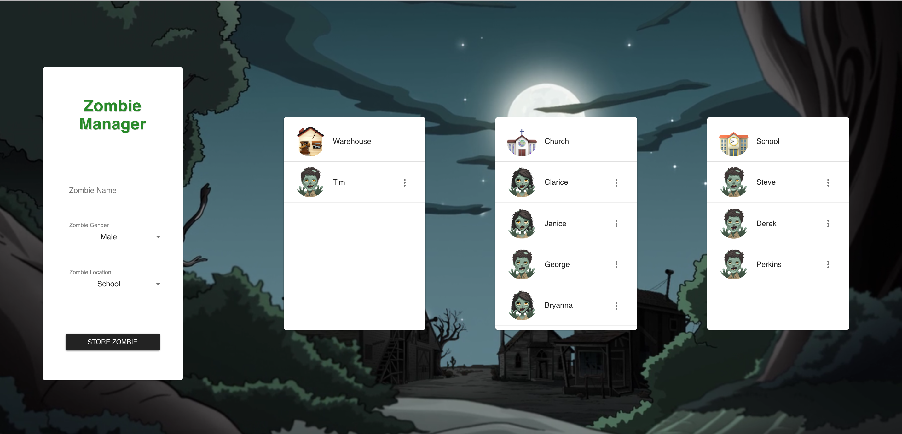
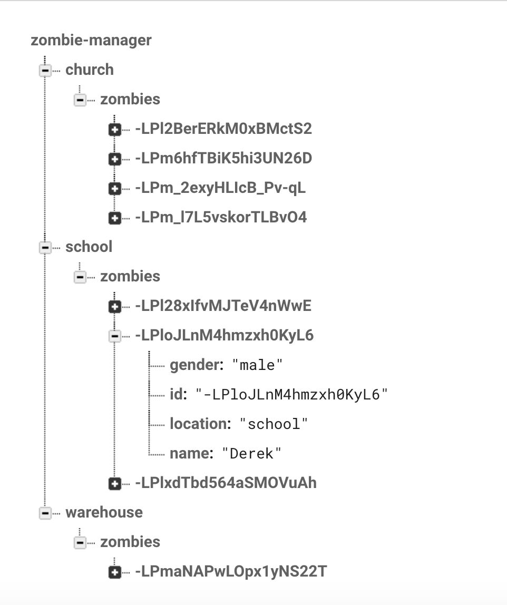

#To use:

1. Download this repository
2. Run `yarn` (`Brew install yarn` first if yarn not installed)
3. Run `yarn start`
4. Open up localhost:3000 in a browser

#made with Create React App, Firebase Realtime DB and Material-UI

##Other Screenshots:

