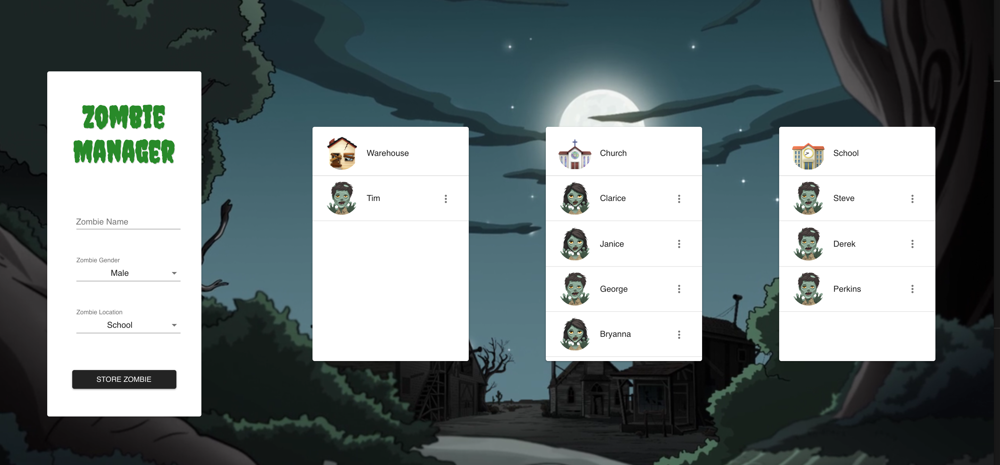

#To use:

1. Download this repository
2. Run `yarn` (`Brew install yarn` first if yarn not installed)
3. Create a .env file in the root of the repository
4. Add firebase credentials in .env file
example:
      ```
REACT_APP_API_KEY=<apiKey>
REACT_APP_AUTH_DOMAIN=<domain>
REACT_APP_DB_URL=<databaseUrl>
REACT_APP_PROJ_ID=<projectName>
REACT_APP_STORAGE_BUCKET=<storageBucket>
REACT_APP_MSG_SENDER_ID=<id>
```
3. Run `yarn start`
4. Open up localhost:3000 in a browser

#made with Create React App, Firebase Realtime DB and Material-UI
